---
## Front matter
title: "Отчёт по лабораторной работе №3"
subtitle: "Дисциплина: Архитектура компьютера"
author: "Мишина Анастасия Алексеевна"

## Generic options
lang: ru-RU
toc-title: "Содержание"

## Bibliography
bibliography: bib/cite.bib
csl: pandoc/csl/gost-r-7-0-5-2008-numeric.csl

## Pdf output format
toc: true # Table of contents
toc-depth: 2
lof: true # List of figures
lot: true # List of tables
fontsize: 14pt
linestretch: 1.5
papersize: a4
documentclass: scrreprt
## I18n polyglossia
polyglossia-lang:
  name: russian
  options:
	- spelling=modern
	- babelshorthands=true
polyglossia-otherlangs:
  name: english
## I18n babel
babel-lang: russian
babel-otherlangs: english
## Fonts
mainfont: PT Serif
romanfont: PT Serif
sansfont: PT Sans
monofont: PT Mono
mainfontoptions: Ligatures=TeX
romanfontoptions: Ligatures=TeX
sansfontoptions: Ligatures=TeX,Scale=MatchLowercase
monofontoptions: Scale=MatchLowercase,Scale=0.9
## Biblatex
biblatex: true
biblio-style: "gost-numeric"
biblatexoptions:
  - parentracker=true
  - backend=biber
  - hyperref=auto
  - language=auto
  - autolang=other*
  - citestyle=gost-numeric
## Pandoc-crossref LaTeX customization
figureTitle: "Рис."
tableTitle: "Таблица"
listingTitle: "Листинг"
lofTitle: "Список иллюстраций"
lotTitle: "Список таблиц"
lolTitle: "Листинги"
## Misc options
indent: true
header-includes:
  - \usepackage{indentfirst}
  - \usepackage{float} # keep figures where there are in the text
  - \floatplacement{figure}{H} # keep figures where there are in the text
---

# Цель работы

Целью работы является изучить идеологию и применение средств контроля версий. Приобрести практические навыки по работе с системой git.

# Выполнение лабораторной работы

В данной части лабораторной работы я работала с системой git, используя командную строку и github.
Для начала создаем и настраиваем аккаунт на github (рис. [-@fig:001]).

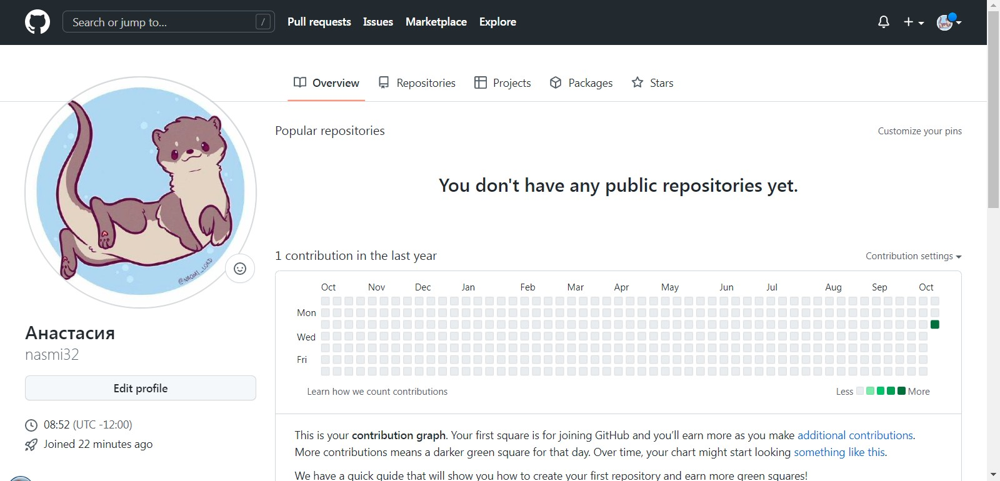{ #fig:001 width=70% }

Далее задаем предварительную конфигурацию git (рис. [-@fig:002]).

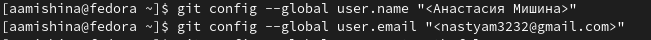{ #fig:002 width=90% }

Теперь настроим utf-8 в выводе сообщений git. Зададим имя master для начальной ветки и настроим параметры autocrlf и safecrlf (рис. [-@fig:003]).

{ #fig:003 width=90% }

Создадим SSH ключ генерацией в командной строке. Укажем необходимый для сохранения ключей каталог (~/.ssh/.) (рис. [-@fig:004]).

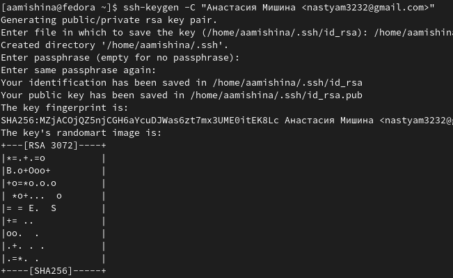{ #fig:004 width=70% }

Зайдем на сайт github и загрузим наш ключ, предварительно скопировав (рис. [-@fig:005]) его из терминала при помощи команд cat и xclip. Назовем его Key1 (рис. [-@fig:006]). 

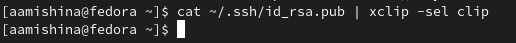{ #fig:005 width=90% }

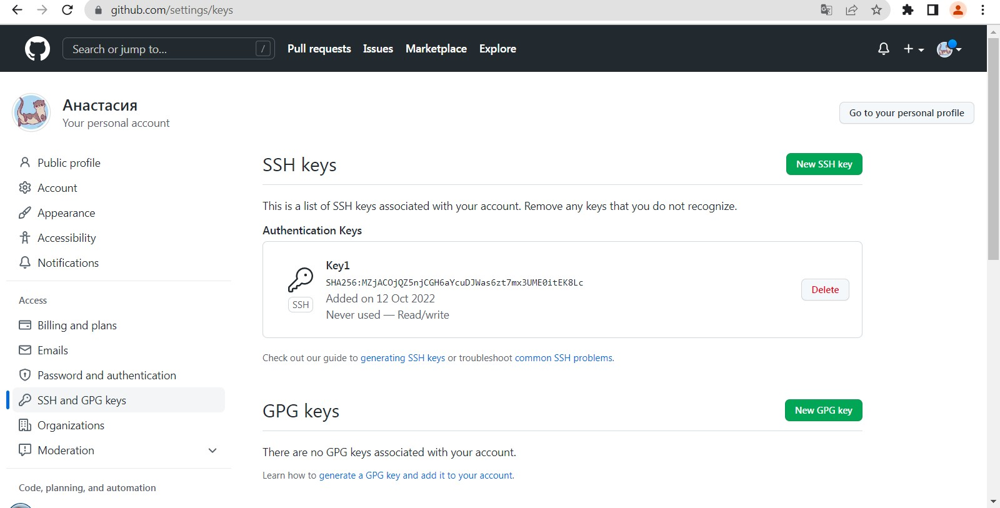{ #fig:006 width=70% }

Теперь создаем каталог для предмета «Архитектура компьютера» (рис. [-@fig:007]).

{ #fig:007 width=90% }

Переходим на страницу с шаблоном курса (рис. [-@fig:008]) и создаем свой репозиторий по нему, пользуясь web-интерфейсом github. Репозиторий называем «study_2022–2023_arh-pc» (рис. [-@fig:009]).

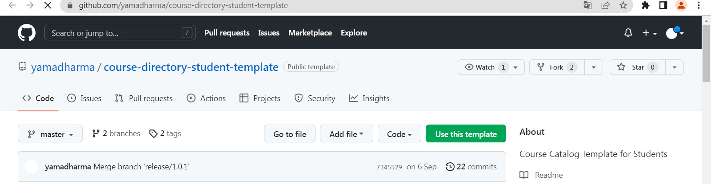{ #fig:008 width=90% }

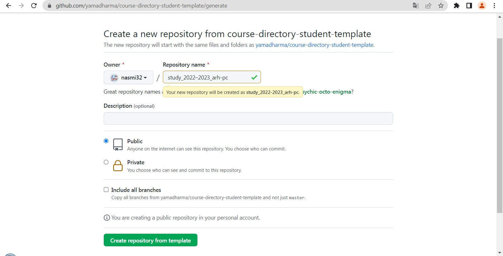{ #fig:009 width=70% }

Возвращаемся к терминалу и переходим в созданный каталог курса (рис. [-@fig:010]). Клонируем наш репозиторий (рис. [-@fig:011]).

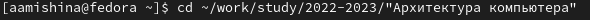{ #fig:010 width=90% }

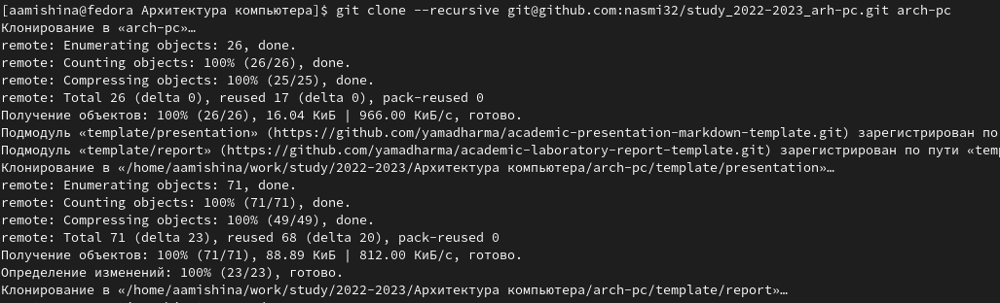{ #fig:011 width=90% }

Теперь настроим каталог курса. Зайдем в него, удалим лишние файлы и создадим необходимые каталоги (рис. [-@fig:012]). Затем отправим файлы на сервер (рис. [-@fig:013]).

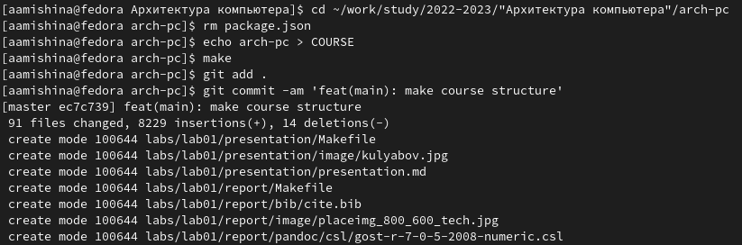{ #fig:012 width=70% }

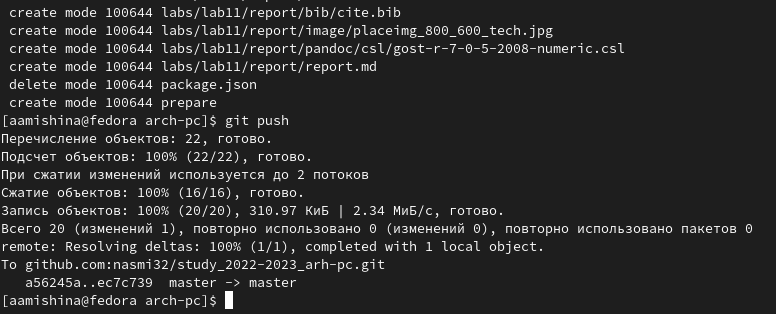{ #fig:013 width=70% }

Сверим правильность выполнения заданий на локальном репозитории и на сайте github (рис. [-@fig:014]), (рис. [-@fig:015]).

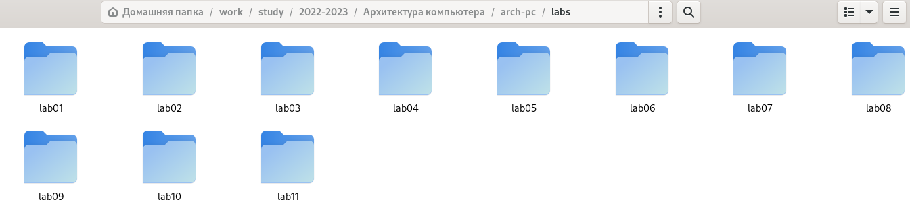{ #fig:014 width=70% }

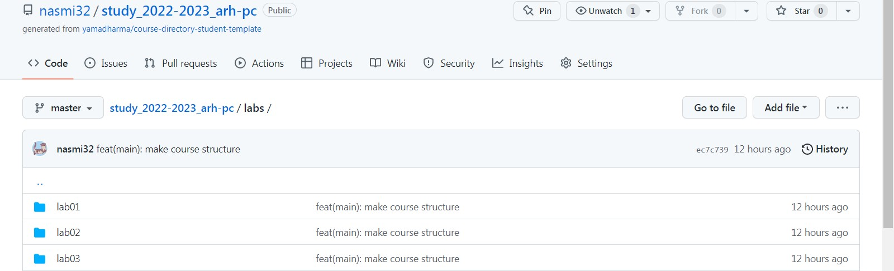{ #fig:015 width=70% }

# Выполнение заданий самостоятельной работы

В качестве заданий для самостоятельной работы, я загрузила на github первую, вторую и третью лабораторные работы. В отчете прикреплены скриншоты к загрузке первых двух работ (рис. [-@fig:016]), (рис. [-@fig:017]).

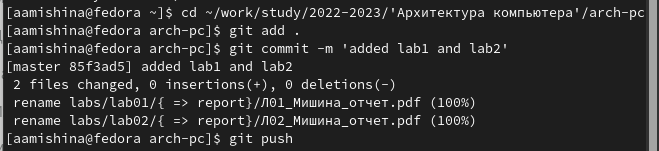{ #fig:016 width=70% }

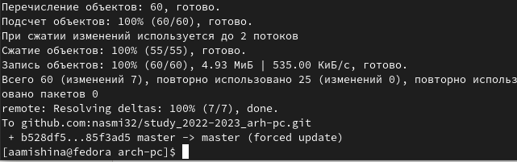{ #fig:017 width=70% }

# Выводы

В ходе выполнения данной лабораторной работы я изучила идеологию и применение средств контроля версий. Я создала свой репозиторий на github и приобрела базовые навыки по работе с системой git. Также я загрузила файлы отчетов своих лабораторных работ в новый репозиторий. Все вышеперечисленное было записано и показано мной в данной лабораторной работе.
