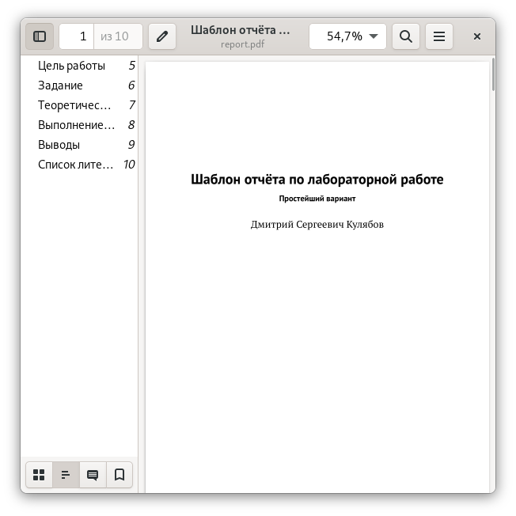

---
## Front matter
title: "Отчёт по лабораторной работе №4"
subtitle: "Дисциплина: Архитектура компьютера"
author: "Мишина Анастасия Алексеевна"

## Generic options
lang: ru-RU
toc-title: "Содержание"

## Bibliography
bibliography: bib/cite.bib
csl: pandoc/csl/gost-r-7-0-5-2008-numeric.csl

## Pdf output format
toc: true # Table of contents
toc-depth: 2
lof: true # List of figures
lot: true # List of tables
fontsize: 14pt
linestretch: 1.5
papersize: a4
documentclass: scrreprt
## I18n polyglossia
polyglossia-lang:
  name: russian
  options:
	- spelling=modern
	- babelshorthands=true
polyglossia-otherlangs:
  name: english
## I18n babel
babel-lang: russian
babel-otherlangs: english
## Fonts
mainfont: PT Serif
romanfont: PT Serif
sansfont: PT Sans
monofont: PT Mono
mainfontoptions: Ligatures=TeX
romanfontoptions: Ligatures=TeX
sansfontoptions: Ligatures=TeX,Scale=MatchLowercase
monofontoptions: Scale=MatchLowercase,Scale=0.9
## Biblatex
biblatex: true
biblio-style: "gost-numeric"
biblatexoptions:
  - parentracker=true
  - backend=biber
  - hyperref=auto
  - language=auto
  - autolang=other*
  - citestyle=gost-numeric
## Pandoc-crossref LaTeX customization
figureTitle: "Рис."
tableTitle: "Таблица"
listingTitle: "Листинг"
lofTitle: "Список иллюстраций"
lotTitle: "Список таблиц"
lolTitle: "Листинги"
## Misc options
indent: true
header-includes:
  - \usepackage{indentfirst}
  - \usepackage{float} # keep figures where there are in the text
  - \floatplacement{figure}{H} # keep figures where there are in the text
---

# Цель работы
Целью данной лабораторной работы является освоение процедуры оформления отчетов с помощью
легковесного языка разметки Markdown.

# Выполнение лабораторной работы
Для начала необходимо установить texlive. Скачиваем архив по ссылке с github в папку tmp (рис. [-@fig:001]), распаковываем его (рис. [-@fig:002]), заходим в получившийся каталог и запускаем скрипт install-tl-20221023 (рис. [-@fig:003]). Добавляем /usr/local/texlive/2022/bin/x86_64-linux в PATH (рис. [-@fig:004]).

{ #fig:001 width=90% }

{ #fig:002 width=90% }

{ #fig:003 width=90% }

{ #fig:004 width=90% }

Затем требовалось установить Pandoc и pandoc-crossref. По ссылке скачиваем 18 версию Pandoc и версию pandoc-crossref, ему соответствующую (рис. [-@fig:005]). Распаковываем архивы и копируем файлы в каталог /usr/local/bin/. Выполняем проверку с помощью команды ls (рис. [-@fig:006]).

{ #fig:005 width=90% }

{ #fig:006 width=90% }

{ #fig:007 width=90% }

Теперь перейдем к главной части выполнения работы. Открываем терминал и переходим в каталог курса. Обновляем локальный репозиторий с помощью команды git pull. Переходим в каталог с шаблоном отчета для работы №4 и компилируем шаблон с помощью команды make (рис. [-@fig:008]). Проверим корректность выполненных команд и откроем docx и pdf файлы (рис. [-@fig:009]), (рис. [-@fig:010]).

{ #fig:008 width=90% }

{ #fig:009 width=90% }

{ #fig:010 width=90% }

С помощью команды make clean удаляем создавшиеся файлы (рис. [-@fig:011]). Снова проверим это в проводнике (рис. [-@fig:012]).

{ #fig:011 width=90% }

{ #fig:012 width=90% }

# Выполнение заданий самостоятельной работы

В заданиях для самостоятельной работы требовалось создать отчет по третьей лабораторной, используя разметку MarkDown. Для начала оформляем отчет.

Затем с помощью команды make в каталоге report каталога lab03 создадим файлы типа docx и pdf.

{ #fig:013 width=90% }

Отчеты в трех форматах прикреплены на git.

# Выводы

В ходе выполнения данной лабораторной работы я освоила процедуры оформления отчетов с помощью
легковесного языка разметки Markdown. Ипользуя данную разметку, мной были написаны отчеты для третьей и четвертой лабораторных работ. Весь ход выполнения работы был записан и показан в данной лабораторной.
