---
## Front matter
title: "Отчёт по лабораторной работе №5"
subtitle: "Дисциплина: Архитектура компьютера"
author: "Мишина Анастасия Алексеевна"

## Generic options
lang: ru-RU
toc-title: "Содержание"

## Bibliography
bibliography: bib/cite.bib
csl: pandoc/csl/gost-r-7-0-5-2008-numeric.csl

## Pdf output format
toc: true # Table of contents
toc-depth: 2
lof: true # List of figures
lot: true # List of tables
fontsize: 14pt
linestretch: 1.5
papersize: a4
documentclass: scrreprt
## I18n polyglossia
polyglossia-lang:
  name: russian
  options:
	- spelling=modern
	- babelshorthands=true
polyglossia-otherlangs:
  name: english
## I18n babel
babel-lang: russian
babel-otherlangs: english
## Fonts
mainfont: PT Serif
romanfont: PT Serif
sansfont: PT Sans
monofont: PT Mono
mainfontoptions: Ligatures=TeX
romanfontoptions: Ligatures=TeX
sansfontoptions: Ligatures=TeX,Scale=MatchLowercase
monofontoptions: Scale=MatchLowercase,Scale=0.9
## Biblatex
biblatex: true
biblio-style: "gost-numeric"
biblatexoptions:
  - parentracker=true
  - backend=biber
  - hyperref=auto
  - language=auto
  - autolang=other*
  - citestyle=gost-numeric
## Pandoc-crossref LaTeX customization
figureTitle: "Рис."
tableTitle: "Таблица"
listingTitle: "Листинг"
lofTitle: "Список иллюстраций"
lotTitle: "Список таблиц"
lolTitle: "Листинги"
## Misc options
indent: true
header-includes:
  - \usepackage{indentfirst}
  - \usepackage{float} # keep figures where there are in the text
  - \floatplacement{figure}{H} # keep figures where there are in the text
---

# Цель работы

Освоение процедуры компиляции и сборки программ, написанных на ассемблере NASM.

# Выполнение лабораторной работы
Для начала создаем каталог для работы и переходим в него. В новом каталоге создаем текстовый файл с именем hello.asm и открываем его с помощью gedit (рис. [-@fig:001]). 

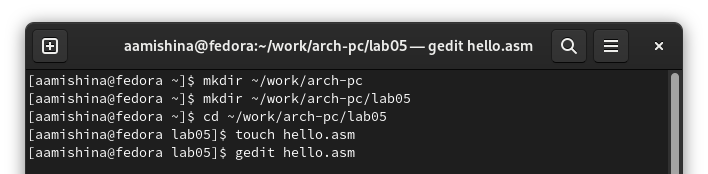{ #fig:001 width=90% }

Теперь введем текст из мануала в файл hello.asm (рис. [-@fig:002]).

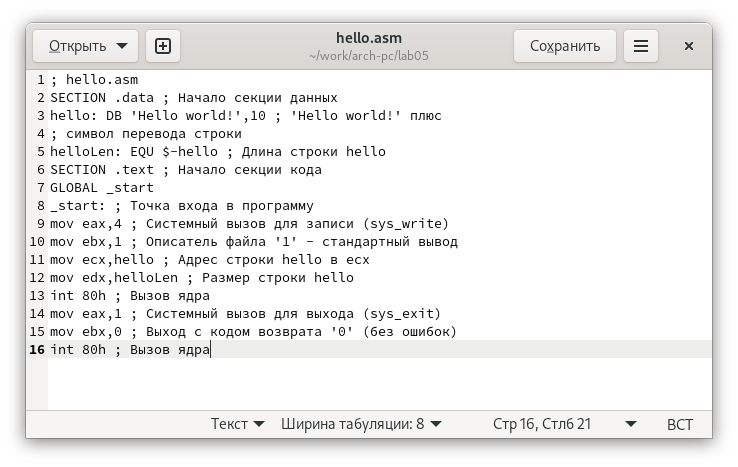{ #fig:002 width=90% }

Далее создаем объектный файл для нашей программы. Получаем на выходе файл с именем hello.o (выполняем проверку с помощью команды ls) (рис. [-@fig:003]).

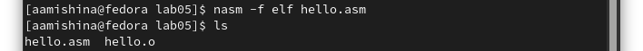{ #fig:003 width=90% }

Также воспользуемся командой с расширенным синтаксисом: компилируем исходный файл в obj.o и попутно создаем файл листинга list.lst. Снова убеждаемся в правильности выполнения действий командой ls (рис. [-@fig:004]).

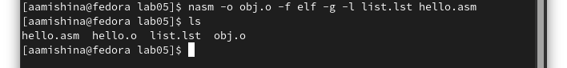{ #fig:004 width=90% }

Передаем объектный файл на обработку компоновщику командой ld для создания исполняемого файла hello (рис. [-@fig:005]).

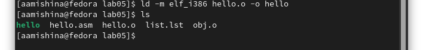{ #fig:005 width=90% }

Также создадим исполняемый файл для объектного файла с именем obj.o, который будет иметь имя main (рис. [-@fig:006]).

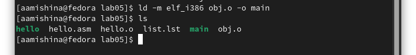{ #fig:006 width=90% }

Последним этапом является запуск файла hello при помощи команды ./hello (рис. [-@fig:007]).

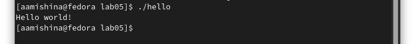{ #fig:007 width=90% }

# Выполнение заданий самостоятельной работы

В каталоге ~/work/arch-pc/lab05 создадим копию файла hello.asm с именем lab5.asm. Заменим в файле программы "Hello world!" на "Мишина Анастасия" (рис. [-@fig:008]). Затем формируем объектный (lab5.o) и исполняемый (lab5) файлы (рис. [-@fig:009]). 

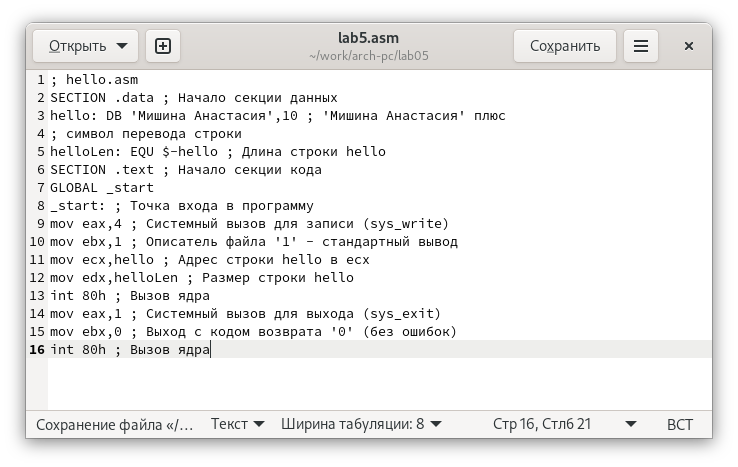{ #fig:008 width=90% }

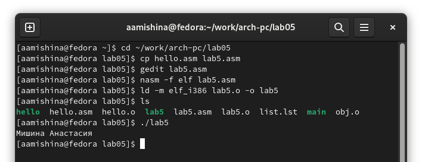{ #fig:009 width=90% }

Копируем файлы hello.asm и lab5.asm в локальный репозиторий (рис. [-@fig:010]), загружаем файлы на Github (рис. [-@fig:011]).

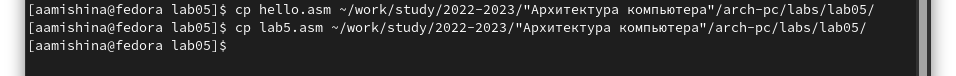{ #fig:010 width=90% }

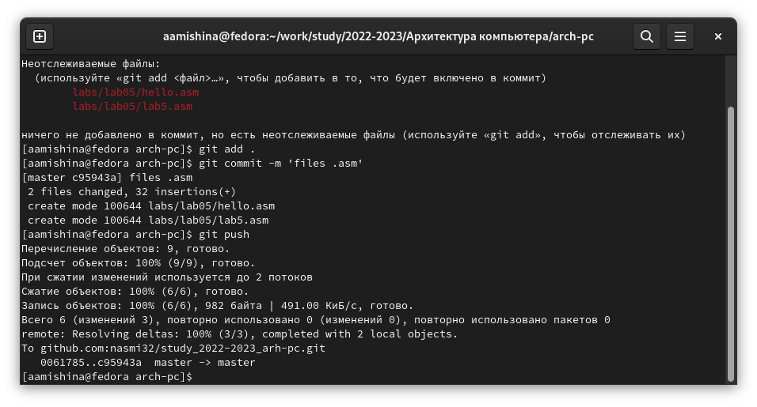{ #fig:011 width=90% }

# Выводы

В ходе выполнения данной лабораторной работы я освоила процедуры компиляции и сборки программ, написанных на ассемблере NASM. Вся моя работа была записана и показана в данной лабораторной.
