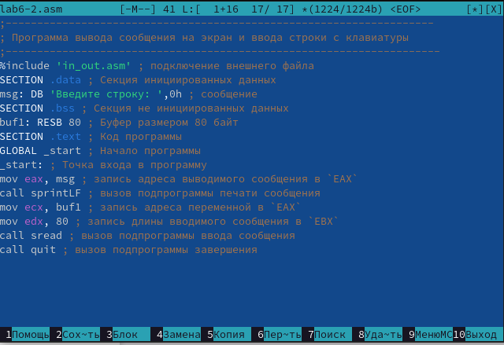
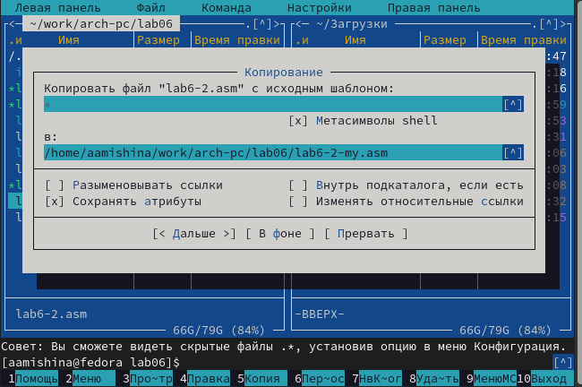

---
## Front matter
title: "Отчёт по лабораторной работе №6"
subtitle: "Дисциплина: Архитектура компьютера"
author: "Мишина Анастасия Алексеевна"

## Generic options
lang: ru-RU
toc-title: "Содержание"

## Bibliography
bibliography: bib/cite.bib
csl: pandoc/csl/gost-r-7-0-5-2008-numeric.csl

## Pdf output format
toc: true # Table of contents
toc-depth: 2
lof: true # List of figures
lot: true # List of tables
fontsize: 14pt
linestretch: 1.5
papersize: a4
documentclass: scrreprt
## I18n polyglossia
polyglossia-lang:
  name: russian
  options:
	- spelling=modern
	- babelshorthands=true
polyglossia-otherlangs:
  name: english
## I18n babel
babel-lang: russian
babel-otherlangs: english
## Fonts
mainfont: PT Serif
romanfont: PT Serif
sansfont: PT Sans
monofont: PT Mono
mainfontoptions: Ligatures=TeX
romanfontoptions: Ligatures=TeX
sansfontoptions: Ligatures=TeX,Scale=MatchLowercase
monofontoptions: Scale=MatchLowercase,Scale=0.9
## Biblatex
biblatex: true
biblio-style: "gost-numeric"
biblatexoptions:
  - parentracker=true
  - backend=biber
  - hyperref=auto
  - language=auto
  - autolang=other*
  - citestyle=gost-numeric
## Pandoc-crossref LaTeX customization
figureTitle: "Рис."
tableTitle: "Таблица"
listingTitle: "Листинг"
lofTitle: "Список иллюстраций"
lotTitle: "Список таблиц"
lolTitle: "Листинги"
## Misc options
indent: true
header-includes:
  - \usepackage{indentfirst}
  - \usepackage{float} # keep figures where there are in the text
  - \floatplacement{figure}{H} # keep figures where there are in the text
---

# Цель работы

Приобретение практических навыков работы в Midnight Commander. Освоение
инструкций языка ассемблера mov и int.

# Выполнение лабораторной работы
Для начала открываем Midnight Commander с помощью команды mc, переходим в каталог ~/work/arch-pc (рис. [-@fig:001]). Создаем каталог для шестой работы, используя команду F7 (рис. [-@fig:002]). 

{ #fig:001 width=90% }

{ #fig:002 width=90% }

В новом каталоге создаем файл lab6-1.asm (рис. [-@fig:003]) и открываем его с помощью клавиши F4. Теперь введем текст 6.1 из мануала в файл (рис. [-@fig:004]).

{ #fig:003 width=90% }

{ #fig:004 width=90% }

Программа lab6-1.asm:
```nasm
;------------------------------------------------------------------
; Программа вывода сообщения на экран и ввода строки с клавиатуры
;------------------------------------------------------------------
;------------------- Объявление переменных ----------------
SECTION .data ; Секция инициированных данных
msg: DB 'Введите строку:',10 ; сообщение плюс
; символ перевода строки
msgLen: EQU $-msg ; Длина переменной 'msg'
SECTION .bss ; Секция не инициированных данных
buf1: RESB 80 ; Буфер размером 80 байт
;------------------- Текст программы -----------------
SECTION .text ; Код программы
GLOBAL _start ; Начало программы
_start: ; Точка входа в программу
;------------ Cистемный вызов `write`
; После вызова инструкции 'int 80h' на экран будет
; выведено сообщение из переменной 'msg' длиной 'msgLen'
mov eax,4 ; Системный вызов для записи (sys_write)
mov ebx,1 ; Описатель файла 1 - стандартный вывод
mov ecx,msg ; Адрес строки 'msg' в 'ecx'
mov edx,msgLen ; Размер строки 'msg' в 'edx'
int 80h ; Вызов ядра
;------------ системный вызов `read` ----------------------
; После вызова инструкции 'int 80h' программа будет ожидать ввода
; строки, которая будет записана в переменную 'buf1' размером 80 байт
mov eax, 3 ; Системный вызов для чтения (sys_read)
mov ebx, 0 ; Дескриптор файла 0 - стандартный ввод
mov ecx, buf1 ; Адрес буфера под вводимую строку
mov edx, 80 ; Длина вводимой строки
int 80h ; Вызов ядра
;------------ Системный вызов `exit` ----------------------
; После вызова инструкции 'int 80h' программа завершит работу
mov eax,1 ; Системный вызов для выхода (sys_exit)
mov ebx,0 ; Выход с кодом возврата 0 (без ошибок)
int 80h ; Вызов ядра
```

Пользуясь клавишами F2, F10, F3 сохраняем программу, выходим из редактора и открываем файл для просмотра, убеждаемся, что все на месте.

Далее преобразовываем текст программы в объектный файл, выполняем компоновку и запускаем исполняемый файл. Вводим ФИО, программа отрабатывает (рис. [-@fig:005]).

{ #fig:005 width=90% }

Скачиваем файл in_out.asm из ТУИСа, копируем его из каталога загрузок в каталог lab06 (рис. [-@fig:006]).

{ #fig:006 width=90% }

Создаем копию файла lab6-1.asm с помощью клавиши F5, называем его lab6-2.asm (рис. [-@fig:007]). Вставляем код 6.2 в новый файл (рис. [-@fig:008]).

{ #fig:007 width=90% }

{ #fig:008 width=90% }

Программа lab6-2.asm:
```nasm
;--------------------------------------------------------------------
; Программа вывода сообщения на экран и ввода строки с клавиатуры
;---------------------------------------------------------------------
%include 'in_out.asm' ; подключение внешнего файла
SECTION .data ; Секция инициированных данных
msg: DB 'Введите строку: ',0h ; сообщение
SECTION .bss ; Секция не инициированных данных
buf1: RESB 80 ; Буфер размером 80 байт
SECTION .text ; Код программы
GLOBAL _start ; Начало программы
_start: ; Точка входа в программу
mov eax, msg ; запись адреса выводимого сообщения в `EAX`
call sprintLF ; вызов подпрограммы печати сообщения
mov ecx, buf1 ; запись адреса переменной в `EAX`
mov edx, 80 ; запись длины вводимого сообщения в `EBX`
call sread ; вызов подпрограммы ввода сообщения
call quit ; вызов подпрограммы завершения
```

Создаем исполняемый файл, убеждаемся в его работоспособности (рис. [-@fig:009]).

{ #fig:009 width=90% }

Заменяем подпрограмму spinrLF на sprint (рис. [-@fig:010]). Пересоздаем исполняемый файл, заметим следующую разницу: теперь нет символа перевода строки при выводе надписи "Введите строку", следовательно ввод текста будет происходить без перехода на новую строку (рис. [-@fig:011]).

{ #fig:010 width=90% }

{ #fig:011 width=90% }

# Выполнение заданий самостоятельной работы

Для начала создадим копию файла lab6-1.asm (рис. [-@fig:012]). Как мы знаем, эта программа уже умеет выводить приглашение типа "Введите строку", также она считывает нашу строку и записывает ее в buf1. Ориентируясь на вывод сообщения, создаем кусочек кода, который выводит строку, записанную в buf1 (рис. [-@fig:013]). Убеждаемся в работоспособности программы (рис. [-@fig:014]).

{ #fig:012 width=90% }

{ #fig:013 width=90% }

{ #fig:014 width=90% }

Программа lab6-1-my.asm:
```nasm
;------------------------------------------------------------------
; Программа вывода сообщения на экран и ввода строки с клавиатуры
;------------------------------------------------------------------
;------------------- Объявление переменных ----------------
SECTION .data ; Секция инициированных данных
msg: DB 'Введите строку:',10 ; сообщение плюс
; символ перевода строки
msgLen: EQU $-msg ; Длина переменной 'msg'
SECTION .bss ; Секция не инициированных данных
buf1: RESB 80 ; Буфер размером 80 байт
;------------------- Текст программы -----------------
SECTION .text ; Код программы
GLOBAL _start ; Начало программы
_start: ; Точка входа в программу
;------------ Cистемный вызов `write`
; После вызова инструкции 'int 80h' на экран будет
; выведено сообщение из переменной 'msg' длиной 'msgLen'
mov eax,4 ; Системный вызов для записи (sys_write)
mov ebx,1 ; Описатель файла 1 - стандартный вывод
mov ecx,msg ; Адрес строки 'msg' в 'ecx'
mov edx,msgLen ; Размер строки 'msg' в 'edx'
int 80h ; Вызов ядра
;------------ системный вызов `read` ----------------------
; После вызова инструкции 'int 80h' программа будет ожидать ввода
; строки, которая будет записана в переменную 'buf1' размером 80 байт
mov eax, 3 ; Системный вызов для чтения (sys_read)
mov ebx, 0 ; Дескриптор файла 0 - стандартный ввод
mov ecx, buf1 ; Адрес буфера под вводимую строку
mov edx, 80 ; Длина вводимой строки
int 80h ; Вызов ядра

mov eax, 4
mov ebx, 1
mov edx, buf1
mov edx, 80
int 80h
;------------ Системный вызов `exit` ----------------------
; После вызова инструкции 'int 80h' программа завершит работу
mov eax,1 ; Системный вызов для выхода (sys_exit)
mov ebx,0 ; Выход с кодом возврата 0 (без ошибок)
int 80h ; Вызов ядра
```

Теперь делаем копию файла lab6-2.asm (рис. [-@fig:015]), там также добавляем вывод нашей строки (рис. [-@fig:016]). Создаем исполняемый файл, убеждаемся, что все работает (рис. [-@fig:017]).

{ #fig:015 width=90% }

{ #fig:016 width=90% }

{ #fig:017 width=90% }

Программа lab6-2-my.asm:
```nasm
;--------------------------------------------------------------------
; Программа вывода сообщения на экран и ввода строки с клавиатуры
;---------------------------------------------------------------------
%include 'in_out.asm' ; подключение внешнего файла
SECTION .data ; Секция инициированных данных
msg: DB 'Введите строку: ',0h ; сообщение
SECTION .bss ; Секция не инициированных данных
buf1: RESB 80 ; Буфер размером 80 байт
SECTION .text ; Код программы
GLOBAL _start ; Начало программы
_start: ; Точка входа в программу
mov eax, msg ; запись адреса выводимого сообщения в `EAX`
call sprint ; вызов подпрограммы печати сообщения
mov ecx, buf1 ; запись адреса переменной в `EAX`
mov edx, 80 ; запись длины вводимого сообщения в `EBX`
call sread ; вызов подпрограммы ввода сообщения
mov eax, buf1
call sprint
call quit ; вызов подпрограммы завершения
```

# Выводы

В ходе выполнения данной лабораторной работы я приобрела практические навыки работы в Midnight Commander. Также я освоила инструкции языка ассемблера mov и int. Вся моя работа была записана и показана в данной лабораторной.
