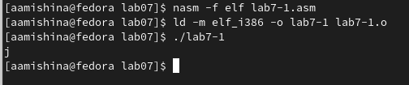

---
## Front matter
title: "Отчёт по лабораторной работе №7"
subtitle: "Дисциплина: Архитектура компьютера"
author: "Мишина Анастасия Алексеевна"

## Generic options
lang: ru-RU
toc-title: "Содержание"

## Bibliography
bibliography: bib/cite.bib
csl: pandoc/csl/gost-r-7-0-5-2008-numeric.csl

## Pdf output format
toc: true # Table of contents
toc-depth: 2
lof: true # List of figures
lot: true # List of tables
fontsize: 14pt
linestretch: 1.5
papersize: a4
documentclass: scrreprt
## I18n polyglossia
polyglossia-lang:
  name: russian
  options:
	- spelling=modern
	- babelshorthands=true
polyglossia-otherlangs:
  name: english
## I18n babel
babel-lang: russian
babel-otherlangs: english
## Fonts
mainfont: PT Serif
romanfont: PT Serif
sansfont: PT Sans
monofont: PT Mono
mainfontoptions: Ligatures=TeX
romanfontoptions: Ligatures=TeX
sansfontoptions: Ligatures=TeX,Scale=MatchLowercase
monofontoptions: Scale=MatchLowercase,Scale=0.9
## Biblatex
biblatex: true
biblio-style: "gost-numeric"
biblatexoptions:
  - parentracker=true
  - backend=biber
  - hyperref=auto
  - language=auto
  - autolang=other*
  - citestyle=gost-numeric
## Pandoc-crossref LaTeX customization
figureTitle: "Рис."
tableTitle: "Таблица"
listingTitle: "Листинг"
lofTitle: "Список иллюстраций"
lotTitle: "Список таблиц"
lolTitle: "Листинги"
## Misc options
indent: true
header-includes:
  - \usepackage{indentfirst}
  - \usepackage{float} # keep figures where there are in the text
  - \floatplacement{figure}{H} # keep figures where there are in the text
---

# Цель работы

Освоение арифметических инструкций языка ассемблера NASM.

# Выполнение лабораторной работы

Для начала создадим каталог для программ 7-ой лабораторной работы, перейдем в нее и создадим файл lab7-1.asm (рис. [-@fig:001]).

{ #fig:001 width=90% }

Вводим текст программы из листинга 7.1 в наш файл. Копируем из загрузок файл in_out.asm в каталог lab07 (рис. [-@fig:002]). Создадим и запустим исполняемый файл (рис. [-@fig:003]). Видим в результате символ "j" (сумму ASCII кодов символов 4 и 6).  

Программа lab7-1.asm:
```nasm
%include 'in_out.asm'
SECTION .bss
buf1: RESB 80
SECTION .text
GLOBAL _start
_start:
mov eax,'6'
mov ebx,'4'
add eax,ebx
mov [buf1],eax
mov eax,buf1
call sprintLF
call quit
```

{ #fig:002 width=90% }

{ #fig:003 width=90% }

Меняем символы на числа (рис. [-@fig:005]), пересоздаем исполняемый файл и запускам его (рис. [-@fig:006]). Теперь программа выведет символ с кодом 10.

{ #fig:004 width=90% }

{ #fig:005 width=90% }

Пользуясь таблицой ASCII определяем, что код 10 соответствует символу перевода строки. Данный символ не отображается на экране, однако мы можем заметить пустую строку.

Создаем файл lab7-2.asm в каталоге ~/work/arch-pc-lab07 и вводим в него текст программы (листинг 7.2) (рис. [-@fig:006]). В результате выводится число 106 (сумма кодов символов '6' и '4', преобразованная в число).

Программа lab7-2.asm:
```nasm
%include 'in_out.asm'
SECTION .text
GLOBAL _start
_start:
mov eax,'6'
mov ebx,'4'
add eax,ebx
call iprintLF
call quit
```

{ #fig:006 width=90% }

Аналогично действиям выше меняем символы на числа (рис. [-@fig:007]). Создаем и запускаем измененный исполняемый файл. Теперь программа складывает сами числа, а не их коды, результатом является число 10 (рис. [-@fig:008]).

{ #fig:007 width=90% }

{ #fig:008 width=90% }

Поменяем функцию iprintLF на iprint. Пересоздаем исполняемый файл, заметим, что теперь нет символа перевода строки (рис. [-@fig:009]).

{ #fig:009 width=90% }

Создаем файл lab7-3.asm, вводим в него текст программы из листинга 7.3 для вычисления следующего выражения: (5*2+3)/3. Создаем и запускаем исполняемый файл (рис. [-@fig:010]).

Программа lab7-3.asm:
```nasm
;--------------------------------
; Программа вычисления выражения
;--------------------------------
%include 'in_out.asm' ; подключение внешнего файла
SECTION .data
div: DB 'Результат: ',0
rem: DB 'Остаток от деления: ',0
SECTION .text
GLOBAL _start
_start:
; ---- Вычисление выражения
mov eax,5 ; EAX=5
mov ebx,2 ; EBX=2
mul ebx ; EAX=EAX*EBX
add eax,3 ; EAX=EAX+3
xor edx,edx ; обнуляем EDX для корректной работы div
mov ebx,3 ; EBX=3
div ebx ; EAX=EAX/3, EDX=остаток от деления
mov edi,eax ; запись результата вычисления в 'edi'
; ---- Вывод результата на экран
mov eax,div ; вызов подпрограммы печати
call sprint ; сообщения 'Результат: '
mov eax,edi ; вызов подпрограммы печати значения
call iprintLF ; из 'edi' в виде символов
mov eax,rem ; вызов подпрограммы печати
call sprint ; сообщения 'Остаток от деления: '
mov eax,edx ; вызов подпрограммы печати значения
call iprintLF ; из 'edx' (остаток) в виде символов
call quit ; вызов подпрограммы завершения
```
{ #fig:010 width=90% }

Изменяем код для подсчета выражения: (4*6+2)/5. Проверяем работу программы (рис. [-@fig:011]).

```nasm
;--------------------------------
; Программа вычисления выражения
;--------------------------------
%include 'in_out.asm' ; подключение внешнего файла
SECTION .data
div: DB 'Результат: ',0
rem: DB 'Остаток от деления: ',0
SECTION .text
GLOBAL _start
_start:
; ---- Вычисление выражения
mov eax,4 ; EAX=4
mov ebx,6 ; EBX=6
mul ebx ; EAX=EAX*EBX
add eax,2 ; EAX=EAX+2
xor edx,edx ; обнуляем EDX для корректной работы div
mov ebx,5 ; EBX=5
div ebx ; EAX=EAX/5, EDX=остаток от деления
mov edi,eax ; запись результата вычисления в 'edi'
; ---- Вывод результата на экран
mov eax,div ; вызов подпрограммы печати
call sprint ; сообщения 'Результат: '
mov eax,edi ; вызов подпрограммы печати значения
call iprintLF ; из 'edi' в виде символов
mov eax,rem ; вызов подпрограммы печати
call sprint ; сообщения 'Остаток от деления: '
mov eax,edx ; вызов подпрограммы печати значения
call iprintLF ; из 'edx' (остаток) в виде символов
call quit ; вызов подпрограммы завершения
```

{ #fig:011 width=90% }

Теперь создадим файл variant.asm для вычисления варианта по номеру студенческого билета. Вводим в новый файл текст программы из листинга 7.4. Создаем и запускаем исполняемый файл, вводим туда свой номер студ. билета, получаем вариант 13 (рис. [-@fig:012]). Аналитически также получаем вариант 13.

Программа variant.asm:
```nasm
;--------------------------------
; Программа вычисления варианта
;--------------------------------
%include 'in_out.asm'
SECTION .data
msg: DB 'Введите No студенческого билета: ',0
rem: DB 'Ваш вариант: ',0
SECTION .bss
x: RESB 80
SECTION .text
GLOBAL _start
_start:
mov eax, msg
call sprintLF
mov ecx, x
mov edx, 80
call sread
mov eax,x ; вызов подпрограммы преобразования
call atoi ; ASCII кода в число, `eax=x`
xor edx,edx
mov ebx,20
div ebx
inc edx
mov eax,rem
call sprint
mov eax,edx
call iprintLF
call quit
```

{ #fig:012 width=90% }

Ответы на вопросы по программе:
1. Строки, отвечающие за вывод сообщение "Ваш вариант:"
```nasm
mov eax,rem
call sprint
```
2. Конструкция "mov ecx, x" используется для того, чтобы положить в регистр ecx адрес х. Конструкция "mov edx, 80" нужна, чтобы записать в регистр edx длину вводимого сообщения. "call sread" позволяет вызвать подпроргамму из внешего файла для ввода сообщения с клавиатуры.
3. Инструкция "call atoi" используется для преобразования ASCII-кода символа в целое число и записи результата в регистр eax.
4. За вычисление варианта отвечают следующие строки кода:
```nasm
xor edx,edx ; обнуление EDX для корректной работы div
mov ebx,20 ; EBX = 20
div ebx ; EAX = EAX/20, EDX - остаток от деления
inc edx ; EDX = EDX + 1
```
5. При выполнении инструкции "div edx" остаток от деления записывается в регистр edx.
6. Инструкция "inc edx" позволяет увеличить значение регистра edx на 1.
7. Строки, отвечающие за вывод на экран результата вычислений:
```nasm
mov eax,edx
call iprintLF
```
# Выполнение заданий самостоятельной работы

Согласно моему варианту (13) мне следовало запрограммировать подсчет функции (8х+6)*10. Создаю файл mytask.asm, пишу код, создаю и запускаю исполняемый файл. Проверяю значения при х = 1 и х = 4. Программа отрабатывает верно (рис. [-@fig:013]).

Программа mytask.asm:
```nasm
;--------------------------------
; Программа вычисления выражения
;--------------------------------
%include 'in_out.asm' ; подключение внешнего файла
SECTION .data
msg: DB 'Введите х для подсчета выражения (8х+6)*10: ',0
res: DB 'Результат: ',0

SECTION .bss
x: RESB 80

SECTION .text
GLOBAL _start
_start:

mov eax, msg
call sprint

mov ecx, x
mov edx, 80
call sread

mov eax, x
call atoi

mov ebx, 8
mul ebx

add eax, 6

mov ebx, 10
mul ebx

mov edi, eax

mov eax, res
call sprint

mov eax, edi
call iprintLF

call quit ; вызов подпрограммы завершения
```

{ #fig:013 width=90% }

# Выводы

В ходе выполнения данной лабораторной работы я освоила арифметические инструкции языка ассемблера NASM. Вся моя работа была записана и прокомментирована мной в данной лабораторной.
