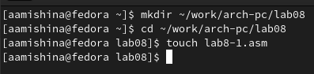
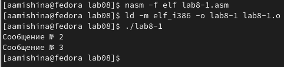
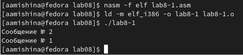
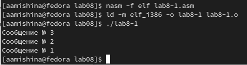
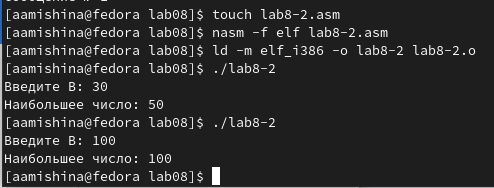
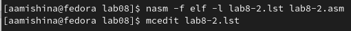
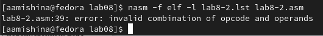
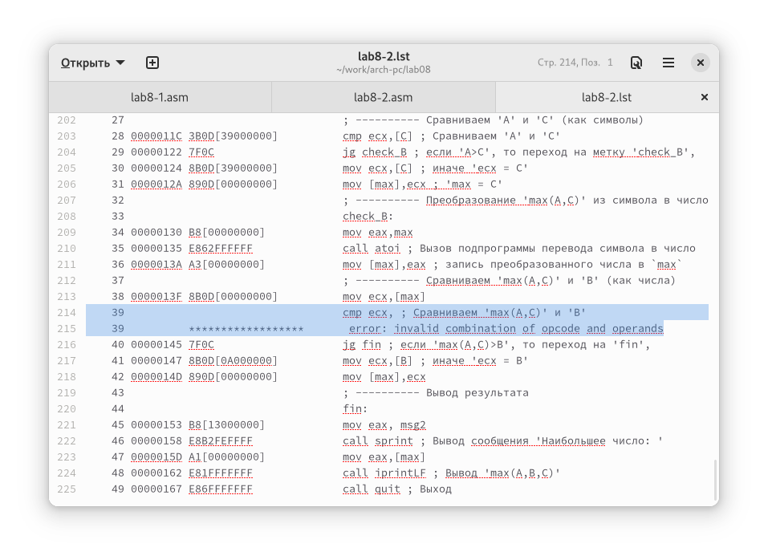
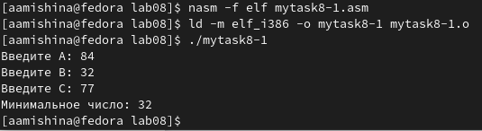
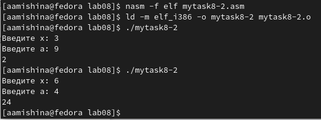

---
## Front matter
title: "Отчёт по лабораторной работе №8"
subtitle: "Дисциплина: Архитектура компьютера"
author: "Мишина Анастасия Алексеевна"

## Generic options
lang: ru-RU
toc-title: "Содержание"

## Bibliography
bibliography: bib/cite.bib
csl: pandoc/csl/gost-r-7-0-5-2008-numeric.csl

## Pdf output format
toc: true # Table of contents
toc-depth: 2
lof: true # List of figures
lot: true # List of tables
fontsize: 14pt
linestretch: 1.5
papersize: a4
documentclass: scrreprt
## I18n polyglossia
polyglossia-lang:
  name: russian
  options:
	- spelling=modern
	- babelshorthands=true
polyglossia-otherlangs:
  name: english
## I18n babel
babel-lang: russian
babel-otherlangs: english
## Fonts
mainfont: PT Serif
romanfont: PT Serif
sansfont: PT Sans
monofont: PT Mono
mainfontoptions: Ligatures=TeX
romanfontoptions: Ligatures=TeX
sansfontoptions: Ligatures=TeX,Scale=MatchLowercase
monofontoptions: Scale=MatchLowercase,Scale=0.9
## Biblatex
biblatex: true
biblio-style: "gost-numeric"
biblatexoptions:
  - parentracker=true
  - backend=biber
  - hyperref=auto
  - language=auto
  - autolang=other*
  - citestyle=gost-numeric
## Pandoc-crossref LaTeX customization
figureTitle: "Рис."
tableTitle: "Таблица"
listingTitle: "Листинг"
lofTitle: "Список иллюстраций"
lotTitle: "Список таблиц"
lolTitle: "Листинги"
## Misc options
indent: true
header-includes:
  - \usepackage{indentfirst}
  - \usepackage{float} # keep figures where there are in the text
  - \floatplacement{figure}{H} # keep figures where there are in the text
---

# Цель работы

Изучение команд условного и безусловного переходов. Приобретение навыков написания программ с использованием переходов. Знакомство с назначением и структурой файла листинга.

# Выполнение лабораторной работы

Для начала создадим каталог для программ 8-ой лабораторной работы, перейдем в нее и создадим файл lab8-1.asm (рис. [-@fig:001]).

{ #fig:001 width=90% }

Вводим текст программы из листинга 8.1 в наш файл. Создадим и запустим исполняемый файл (рис. [-@fig:002]). Программа выводит "Сообщение №2" и "Сообщение №3".

Программа lab8-1.asm:
```nasm
%include 'in_out.asm' ; подключение внешнего файла
SECTION .data
msg1: DB 'Сообщение No 1',0
msg2: DB 'Сообщение No 2',0
msg3: DB 'Сообщение No 3',0
SECTION .text
GLOBAL _start
_start:
jmp _label2
_label1:
mov eax, msg1 ; Вывод на экран строки
call sprintLF ; 'Сообщение No 1'
_label2:
mov eax, msg2 ; Вывод на экран строки
call sprintLF ; 'Сообщение No 2'
_label3:
mov eax, msg3 ; Вывод на экран строки
call sprintLF ; 'Сообщение No 3'
_end:
call quit ; вызов подпрограммы завершения
```

{ #fig:002 width=90% }

Меняем текст программы в соответствии листингом 8.2. Создаем исполняемый файл, видим вывод "Сообщение №2" и "Сообщение №1" (рис. [-@fig:003]).

Измененная программа lab8-1.asm:
```nasm
%include 'in_out.asm' ; подключение внешнего файла
SECTION .data
msg1: DB 'Сообщение No 1',0
msg2: DB 'Сообщение No 2',0
msg3: DB 'Сообщение No 3',0
SECTION .text
GLOBAL _start
_start:
jmp _label2
_label1:
mov eax, msg1 ; Вывод на экран строки
call sprintLF ; 'Сообщение No 1'
jmp _end
_label2:
mov eax, msg2 ; Вывод на экран строки
call sprintLF ; 'Сообщение No 2'
jmp _label1
_label3:
mov eax, msg3 ; Вывод на экран строки
call sprintLF ; 'Сообщение No 3'
_end:
call quit ; вызов подпрограммы завершения
```

{ #fig:003 width=90% }

Меняем текст программы, чтобы вывод был в следующем порядке: "Сообщение №3", "Сообщение №2", "Сообщение №1" (рис. [-@fig:004]).

Измененная программа lab8-1.asm:
```nasm
%include 'in_out.asm' ; подключение внешнего файла
SECTION .data
msg1: DB 'Сообщение № 1',0
msg2: DB 'Сообщение № 2',0
msg3: DB 'Сообщение № 3',0
SECTION .text
GLOBAL _start
_start:
jmp _label3
_label1:
mov eax, msg1 ; Вывод на экран строки
call sprintLF ; 'Сообщение № 1'
jmp _end
_label2:
mov eax, msg2 ; Вывод на экран строки
call sprintLF ; 'Сообщение № 2'
jmp _label1
_label3:
mov eax, msg3 ; Вывод на экран строки
call sprintLF ; 'Сообщение № 3'
jmp _label2
_end:
call quit ; вызов подпрограммы завершения
```

{ #fig:004 width=90% }

Создаем файл lab8-2.asm, вставляем в него текст программы из листинга 8.3 для нахождения наибольшего из 3-ёх чисел. Создаем и запускаем исполняемый файл, проверяем его работу, вводя различные значения переменной B (рис. [-@fig:005]).

Программа lab8-2.asm:
```nasm
%include 'in_out.asm'
section .data
msg1 db 'Введите B: ',0h
msg2 db "Наибольшее число: ",0h
A dd '20'
C dd '50'
section .bss
max resb 10
B resb 10
section .text
global _start
_start:
; ---------- Вывод сообщения 'Введите B: '
mov eax,msg1
call sprint
; ---------- Ввод 'B'
mov ecx,B
mov edx,10
call sread
; ---------- Преобразование 'B' из символа в число
mov eax,B
call atoi ; Вызов подпрограммы перевода символа в число
mov [B],eax ; запись преобразованного числа в 'B'
; ---------- Записываем 'A' в переменную 'max'
mov ecx,[A] ; 'ecx = A'
mov [max],ecx ; 'max = A'
; ---------- Сравниваем 'A' и 'С' (как символы)
cmp ecx,[C] ; Сравниваем 'A' и 'С'
jg check_B ; если 'A>C', то переход на метку 'check_B',
mov ecx,[C] ; иначе 'ecx = C'
mov [max],ecx ; 'max = C'
; ---------- Преобразование 'max(A,C)' из символа в число
check_B:
mov eax,max
call atoi ; Вызов подпрограммы перевода символа в число
mov [max],eax ; запись преобразованного числа в `max`
; ---------- Сравниваем 'max(A,C)' и 'B' (как числа)
mov ecx,[max]
cmp ecx,[B]; Сравниваем 'max(A,C)' и 'B'
jg fin ; если 'max(A,C)>B', то переход на 'fin',
mov ecx,[B] ; иначе 'ecx = B'
mov [max],ecx
; ---------- Вывод результата
fin:
mov eax, msg2
call sprint ; Вывод сообщения 'Наибольшее число: '
mov eax,[max]
call iprintLF ; Вывод 'max(A,B,C)'
call quit ; Выход
```

{ #fig:005 width=90% }

Далее создадим файл листинга для программы из файла lab8-2.asm. Открываем файл с помощью редактора mcedit и изучаем его структуру (рис. [-@fig:006]).

{ #fig:006 width=90% }

Объясним значение трёх строк из файла.

1. 35 00000135 E862FFFFFF              call atoi ; Вызов подпрограммы перевода символа в число. 35 - номер строки, 00000135 - адрес, E862FFFFFF - машинный код, call atoi - код программы.

2. 18 000000F7 BA0A000000              mov edx,10. 18 - номер строки, 000000F7 - адрес, BA0A000000 - машинный код, mov edx,10 - код программы.

3. 48 00000162 E81FFFFFFF              call iprintLF ; Вывод 'max(A,B,C)'. 48 - номер строки, 00000162 - адрес, E81FFFFFFF - машинный код, call iprintLF - код программы.

Теперь открываем файл с программой lab8-2.asm и удаляем один операнд из любой инструкции (рис. [-@fig:007]). Выполняем трансляцию файла. Видим, что выводится сообщения об ошибке и создается только файл листинга (рис. [-@fig:008]), в котором также присутствует сообщение об ошибке (рис. [-@fig:009]).

{ #fig:007 width=90% }

{ #fig:008 width=90% }

{ #fig:009 width=90% }

# Выполнение заданий самостоятельной работы

Для начала пишем программу для нахождения минимального из трех чисел. Согласно моему варианту (13) мне следовало проверить правильность выполнения задания на числах: 84, 32, 77. Программа отработала успешно (рис. [-@fig:010]).

Программа mytask8-1.asm:
```nasm
%include 'in_out.asm' ; подключение внешнего файла
SECTION .data
msg1: DB 'Введите A: ',0
msg2: DB 'Введите B: ',0
msg3: DB 'Введите C: ',0
msg4: DB 'Минимальное число: ',0

SECTION .bss
A: RESB 80
B: RESB 80
C: RESB 80
min: RESB 80
res: RESB 80

SECTION .text
GLOBAL _start

_start:
mov eax, msg1
call sprint
mov ecx, A
mov edx, 80
call sread
mov eax, A
call atoi
mov [A], eax

mov eax, msg2
call sprint
mov ecx, B
mov edx, 80
call sread
mov eax, B
call atoi
mov [B], eax

mov eax, msg3
call sprint
mov ecx, C
mov edx, 80
call sread
mov eax, C
call atoi
mov [C], eax

mov ecx, [A]
mov [min], ecx

cmp ecx, [B]
jl check_C
mov ecx, [B]
mov [min], ecx

check_C:
cmp ecx, [C]
jl _end
mov ecx, [C]
mov [min], ecx

_end:
mov eax, msg4
call sprint

mov eax, [min]
call iprintLF

call quit ; вызов подпрограммы завершения
```

{ #fig:010 width=90% }

Во втором задании требовалось вычислить значение функции 13-ого варианта (f = a − 7, a ≥ 7 и
f = ax, a < 7). Пишем код, создаем и запускаем исполняемый файл, убеждаемся в правильности работы программы (рис. [-@fig:011]).

Программа mytask8-2.asm:
```nasm
%include 'in_out.asm'
SECTION .data
msg1: DB 'Введите x: ',0
msg2: DB 'Введите a: ',0

SECTION .bss
A: RESB 80
X: RESB 80

SECTION .text
GLOBAL _start

_start:
mov eax, msg1
call sprint
mov ecx, X
mov edx, 80
call sread
mov eax, X
call atoi
mov [X], eax

mov eax, msg2
call sprint
mov ecx, A
mov edx, 80
call sread
mov eax, A
call atoi
mov [A], eax 

mov ebx, [A]
cmp ebx, 7
jge first
jmp second

first:
    mov eax,[A]
    add eax,-7
    call iprintLF 
    call quit
second:
    mov eax, [A]
    mov ebx, [X]
    mul ebx
    call iprintLF 
    call quit
```

{ #fig:011 width=90% }

# Выводы

В ходе выполнения данной лабораторной работы я изучила команды условного и безусловного переходов. Приобрела навыки написания программ с использованием переходов. Ознакомилась с назначением и структурой файла листинга. Вся моя работа была записана и прокомментирована мной в данной лабораторной.
