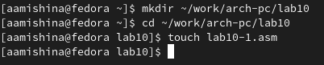
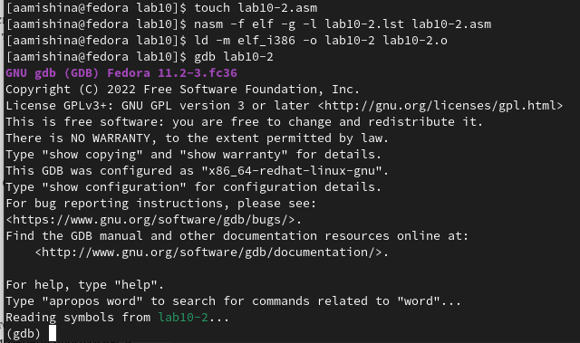
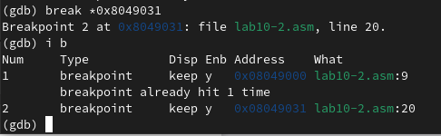

---
## Front matter
title: "Отчёт по лабораторной работе №10"
subtitle: "Дисциплина: Архитектура компьютера"
author: "Мишина Анастасия Алексеевна"

## Generic options
lang: ru-RU
toc-title: "Содержание"

## Bibliography
bibliography: bib/cite.bib
csl: pandoc/csl/gost-r-7-0-5-2008-numeric.csl

## Pdf output format
toc: true # Table of contents
toc-depth: 2
lof: true # List of figures
lot: true # List of tables
fontsize: 14pt
linestretch: 1.5
papersize: a4
documentclass: scrreprt
## I18n polyglossia
polyglossia-lang:
  name: russian
  options:
	- spelling=modern
	- babelshorthands=true
polyglossia-otherlangs:
  name: english
## I18n babel
babel-lang: russian
babel-otherlangs: english
## Fonts
mainfont: PT Serif
romanfont: PT Serif
sansfont: PT Sans
monofont: PT Mono
mainfontoptions: Ligatures=TeX
romanfontoptions: Ligatures=TeX
sansfontoptions: Ligatures=TeX,Scale=MatchLowercase
monofontoptions: Scale=MatchLowercase,Scale=0.9
## Biblatex
biblatex: true
biblio-style: "gost-numeric"
biblatexoptions:
  - parentracker=true
  - backend=biber
  - hyperref=auto
  - language=auto
  - autolang=other*
  - citestyle=gost-numeric
## Pandoc-crossref LaTeX customization
figureTitle: "Рис."
tableTitle: "Таблица"
listingTitle: "Листинг"
lofTitle: "Список иллюстраций"
lotTitle: "Список таблиц"
lolTitle: "Листинги"
## Misc options
indent: true
header-includes:
  - \usepackage{indentfirst}
  - \usepackage{float} # keep figures where there are in the text
  - \floatplacement{figure}{H} # keep figures where there are in the text
---

# Цель работы

Приобретение навыков написания программ с использованием подпрограмм. Знакомство с методами отладки при помощи GDB и его основными возможностями.

# Выполнение лабораторной работы

Для начала создадим каталог для программ 10-ой лабораторной работы, перейдем в него и создадим файл lab10-1.asm (рис. [-@fig:001]).

{ #fig:001 width=90% }

Вводим текст программы из листинга 10.1 в наш файл. Создадим и запустим исполняемый файл, удостоверимся в его работе (рис. [-@fig:002]).

Программа lab10-1.asm:
```nasm
%include 'in_out.asm'
SECTION .data
msg: DB 'Введите x: ',0
result: DB '2x+7=',0
SECTION .bss
x: RESB 80
rezs: RESB 80
SECTION .text
GLOBAL _start
_start:
;------------------------------------------
; Основная программа
;------------------------------------------
mov eax, msg
call sprint
mov ecx, x
mov edx, 80
call sread
mov eax,x
call atoi
call _calcul ; Вызов подпрограммы _calcul
mov eax,result
call sprint
mov eax,[res]
call iprintLF
call quit
;------------------------------------------
; Подпрограмма вычисления
; выражения "2x+7"
_calcul:
mov ebx,2
mul ebx
add eax,7
mov [rez],eax
ret ; выход из подпрограммы
```

{ #fig:002 width=90% }

Меняем текст программы, добавляя подпрограмму _subcalcul для вычисления выражения f(g(x)). Создаем исполняемый файл, программа отрабатывает успешно (рис. [-@fig:003]).

Измененная программа lab10-1.asm:
```nasm
%include 'in_out.asm'
SECTION .data
msg: DB 'Введите x: ',0
result: DB '2(3x-1)+7=',0
SECTION .bss
x: RESB 80
rez: RESB 80
SECTION .text
GLOBAL _start
_start:
;------------------------------------------
; Основная программа
;------------------------------------------
mov eax, msg
call sprint
mov ecx, x
mov edx, 80
call sread
mov eax,x
call atoi
call _calcul ; Вызов подпрограммы _calcul
mov eax,result
call sprint
mov eax,[rez]
call iprintLF
call quit
;------------------------------------------
; Подпрограмма вычисления
; выражения "2x+7"
_calcul:
call _subcalcul
mov ebx,2
mul ebx
add eax,7
mov [rez],eax
ret ; выход из подпрограммы

_subcalcul:
mov ebx, 3
mul ebx
sub eax, 1
ret
```

{ #fig:003 width=90% }

Теперь создадим файл lab10-2.asm, вводим в него текст листинга 10.2. Создаем исполняемый файл с ключом '-g' для работы с GDB. Загружаем исполняемый файл в отладчик gdb (рис. [-@fig:004]). Запускаем программу с помощью команды run, она отрабатывает успешно (рис. [-@fig:005]).

Программа lab10-2.asm:
```nasm
SECTION .data
msg1: db "Hello, ",0x0
msg1Len: equ $ - msg1
msg2: db "world!",0xa
msg2Len: equ $ - msg2
SECTION .text
global _start
_start:
mov eax, 4
mov ebx, 1
mov ecx, msg1
mov edx, msg1Len
int 0x80
mov eax, 4
mov ebx, 1
mov ecx, msg2
mov edx, msg2Len
int 0x80
mov eax, 1
mov ebx, 0
int 0x80
```

{ #fig:004 width=90% }

{ #fig:005 width=90% }

Устанавливаем брейкпоинт на метку _start и запускаем программу еще раз. Посмотрим на дисассимилированный код программы с помощью команды disassemble начиная с метки _start (рис. [-@fig:006]). Переключимся на изображение с Intel'овским синтаксисом (рис. [-@fig:007]). Видим отличие в третьем столбце в изображении названий регистров и переменных. Также отличается порядок переменная-регистр и наоборот регистр-переменная.

{ #fig:006 width=90% }

{ #fig:007 width=90% }

Далее включаем режим псевдографики для более удобного анализа программы. С помощью команды info breakpoints смотрим, что уже установили одну точку остновки (рис. [-@fig:008]). Устанавливаем еще одну, используя адрес инструкции. Снова смотрим информацию о всех брейкпоинтах (рис. [-@fig:009]).

{ #fig:008 width=90% }

{ #fig:009 width=90% }

Далее выполняем ровно 5 раз команду si, видим изменения в регистрах eax, ebx, ecx, edx, esp (рис. [-@fig:010]). Смотрим содержимое регистров (рис. [-@fig:011]).

{ #fig:010 width=90% }

{ #fig:011 width=90% }

Теперь посмотрим значения переменных msg1 по имени и msg2 по адресу. Также смотрим инструкцию mov ecx, msg2 (рис. [-@fig:012]).

{ #fig:012 width=90% }

Меняем символы в перменных msg1 и msg2 (рис. [-@fig:013]).

{ #fig:013 width=90% }

Смотрим значения нескольких регистров (рис. [-@fig:014]). Самостоятельно смотрим значение регистра edx в шестнадцатеричном формате, в двоичном формате и в символьном виде (рис. [-@fig:015]).

{ #fig:014 width=90% }

{ #fig:015 width=90% }

С помощью команды set меняем значение регистра ebx. Сначала выводится 50, так как это ASCII кодировка символа "2", а затем 2 - уже как число (рис. [-@fig:016]).

{ #fig:016 width=90% }

Завершаем выполнение программы (рис. [-@fig:017]).

{ #fig:017 width=90% }

Копируем файл lab9-2.asm в файл с именем lab10-3.asm. Создаем исполняемый файл с отладчиком gdb. Загружаем исполняемый файл в отладчик, указав аргументы (рис. [-@fig:018]).

{ #fig:018 width=90% }

Устанавливаем точку останова перед первой инструкцией в программе и запускаем ее. Смотрим, что хранится в регистре esp, получаем 5 аргументов (рис. [-@fig:019]).

{ #fig:019 width=90% }

Теперь посмотрим остальные позиции стека (рис. [-@fig:020]). Шаг изменения равен 4, потому что шаг равен размеру переменной (4 байта).

{ #fig:020 width=90% }

# Выполнение заданий самостоятельной работы

Для начала дорабатываем программу из 9-ой лабораторной работы. Добавляем подпрограмму для вычисления значения функции (рис. [-@fig:021]).

Программа lab10my.asm:
```nasm
%include 'in_out.asm'
SECTION .data
msg db "Результат: ", 0
func: db 'f(x) = 12x - 7', 0

SECTION .text
global _start
_start:
mov eax, func
call sprintLF

pop ecx
pop edx
sub ecx, 1
mov esi, 0

next:
cmp ecx, 0h
jz _end

pop eax
call atoi

call _calc
add esi, eax

loop next

_end:
mov eax, msg
call sprint

mov eax, esi
call iprintLF

call quit

_calc:
mov ebx, 12
mul ebx

sub eax, 7
ret
```

{ #fig:021 width=90% }

Вторым заданием было определить ошибку в программе, используя отладчик GDB и анализируя изменение значений регистров. Стало понятно, что в нескольких местах следует поменять регистр ebx на eax. Измененная программа отработала успешно (рис. [-@fig:022]), (рис. [-@fig:023]), (рис. [-@fig:024]).

Нерабочий код 10.3:
```nasm
%include 'in_out.asm'
SECTION .data
div: DB 'Результат: ',0
SECTION .text
GLOBAL _start
_start:
; ---- Вычисление выражения (3+2)*4+5
mov ebx,3
mov eax,2
add ebx,eax
mov ecx,4
mul ecx
add ebx,5
mov edi,ebx
; ---- Вывод результата на экран
mov eax,div
call sprint
mov eax,edi
call iprintLF
call quit
```

Исправленный мной код:
```nasm
%include 'in_out.asm'
SECTION .data
div: DB 'Результат: ',0
SECTION .text
GLOBAL _start
_start:
; ---- Вычисление выражения (3+2)*4+5
mov ebx,3
mov eax,2
add eax,ebx
mov ecx,4
mul ecx
add eax,5
mov edi,eax
; ---- Вывод результата на экран
mov eax,div
call sprint
mov eax,edi
call iprintLF
call quit
```

{ #fig:022 width=90% }

{ #fig:023 width=90% }

{ #fig:024 width=90% }

# Выводы

В ходе выполнения данной лабораторной работы я приобрела навыки написания программ с использованием подпрограмм. Также я познакомилась с методами отладки при помощи GDB и его основными возможностями. Вся моя работа была записана и прокомментирована мной в данной лабораторной.
