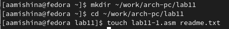
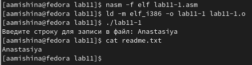
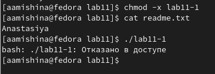
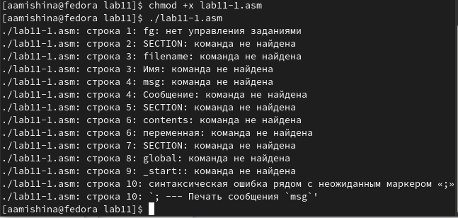
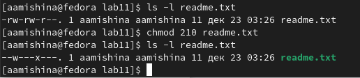
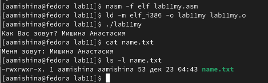

---
## Front matter
title: "Отчёт по лабораторной работе №11"
subtitle: "Дисциплина: Архитектура компьютера"
author: "Мишина Анастасия Алексеевна"

## Generic options
lang: ru-RU
toc-title: "Содержание"

## Bibliography
bibliography: bib/cite.bib
csl: pandoc/csl/gost-r-7-0-5-2008-numeric.csl

## Pdf output format
toc: true # Table of contents
toc-depth: 2
lof: true # List of figures
lot: true # List of tables
fontsize: 14pt
linestretch: 1.5
papersize: a4
documentclass: scrreprt
## I18n polyglossia
polyglossia-lang:
  name: russian
  options:
	- spelling=modern
	- babelshorthands=true
polyglossia-otherlangs:
  name: english
## I18n babel
babel-lang: russian
babel-otherlangs: english
## Fonts
mainfont: PT Serif
romanfont: PT Serif
sansfont: PT Sans
monofont: PT Mono
mainfontoptions: Ligatures=TeX
romanfontoptions: Ligatures=TeX
sansfontoptions: Ligatures=TeX,Scale=MatchLowercase
monofontoptions: Scale=MatchLowercase,Scale=0.9
## Biblatex
biblatex: true
biblio-style: "gost-numeric"
biblatexoptions:
  - parentracker=true
  - backend=biber
  - hyperref=auto
  - language=auto
  - autolang=other*
  - citestyle=gost-numeric
## Pandoc-crossref LaTeX customization
figureTitle: "Рис."
tableTitle: "Таблица"
listingTitle: "Листинг"
lofTitle: "Список иллюстраций"
lotTitle: "Список таблиц"
lolTitle: "Листинги"
## Misc options
indent: true
header-includes:
  - \usepackage{indentfirst}
  - \usepackage{float} # keep figures where there are in the text
  - \floatplacement{figure}{H} # keep figures where there are in the text
---

# Цель работы

Приобретение навыков написания программ для работы с файлами.

# Выполнение лабораторной работы

Для начала создадим каталог для программ 11-ой лабораторной работы, перейдем в него и создадим файл lab11-1.asm и файл readme.txt (рис. [-@fig:001]).

{ #fig:001 width=90% }

Вводим текст программы из листинга 11.1 в наш файл. Создадим и запустим исполняемый файл, удостоверимся в его работе (рис. [-@fig:002]).

Программа lab11-1.asm:
```nasm
%include 'in_out.asm'
SECTION .data
filename db 'readme.txt', 0h ; Имя файла
msg db 'Введите строку для записи в файл: ', 0h ; Сообщение
SECTION .bss
contents resb 255 ; переменная для вводимой строки
SECTION .text
global _start
_start:
; --- Печать сообщения `msg`
mov eax,msg
call sprint
; ---- Запись введеной с клавиатуры строки в `contents`
mov ecx, contents
mov edx, 255
call sread
; --- Открытие существующего файла (`sys_open`)
mov ecx, 2 ; открываем для записи (2)
mov ebx, filename
mov eax, 5
int 80h
; --- Запись дескриптора файла в `esi`
mov esi, eax
; --- Расчет длины введенной строки
mov eax, contents ; в `eax` запишется количество
call slen ; введенных байтов
; --- Записываем в файл `contents` (`sys_write`)
mov edx, eax
mov ecx, contents
mov ebx, esi
mov eax, 4
int 80h
; --- Закрываем файл (`sys_close`)
mov ebx, esi
mov eax, 6
int 80h
call quit
```

{ #fig:002 width=90% }

Меняем права доступа к исполняемому файлу lab11-1, запрещаем его выполнение. Пытаемся выполнить файл, он не запускается, ведь запуск запрещен (рис. [-@fig:003]).

{ #fig:003 width=90% }

Теперь изменим права доступа к файлу lab11-1.asm, добавим права на исполнение. Запускаем данный файл. Файл запускается, терминал пытается выполнить команды как консольные команды (рис. [-@fig:004]).

{ #fig:004 width=90% }

Далее предоставляем права доступа к файлу readme.txt соответственно варианту 13. -w- --x --- (210). Проверяем правильность выполнения с помощью команды ls -l (рис. [-@fig:005]).

{ #fig:005 width=90% }

# Выполнение заданий самостоятельной работы

В задании для самостоятельной работы требовалось написать программу, работающую по определенному алгоритму. После написания, создаю и запускаю исполняемый файл, он отрабатывает успешно. Проверяем с помощью команд cat и ls (рис. [-@fig:006]).

Программа lab11my.asm:
```nasm
%include 'in_out.asm'
SECTION .data
filename db 'name.txt', 0h ; Имя файла
msg db 'Как Вас зовут? ', 0h ; Сообщение
msg2 db 'Меня зовут: ', 0h

SECTION .bss
in_name: RESB 80 ; переменная для вводимой строки

SECTION .text
global _start

_start:

; --- Печать сообщения `msg`
mov eax,msg
call sprint

; ---- Запись введеной с клавиатуры строки
mov ecx, in_name
mov edx, 80
call sread

mov ecx, 0777o ; установка прав доступа
mov ebx, filename ; имя создаваемого файла
mov eax, 8 ; номер системного вызова `sys_creat`
int 80h ; вызов ядра

mov esi, eax

mov eax, msg2
call slen

mov edx, eax
mov ecx, msg2
mov ebx, esi
mov eax, 4
int 80h

; --- Закрываем файл (`sys_close`)
mov ebx, esi
mov eax, 6
int 80h

mov ecx, 1 ; Открытие файла (1 - для записи).
mov ebx, filename
mov eax, 5
int 80h

mov esi, eax

mov edx, 2 ; значение смещения -- конец файла
mov ecx, 0 ; смещение на 0 байт
mov ebx, eax ; дескриптор файла
mov eax, 19 ; номер системного вызова `sys_lseek`
int 80h ; вызов ядра

mov eax, in_name
call slen

mov edx, eax
mov ecx, in_name
mov ebx, esi
mov eax, 4
int 80h

; --- Закрываем файл (`sys_close`)
mov ebx, esi
mov eax, 6
int 80h

call quit
```

{ #fig:006 width=90% }

# Выводы

В ходе выполнения данной лабораторной работы я приобрела навыки написания программ для работы с файлами. Вся моя работа была записана и прокомментирована мной в данной лабораторной.
